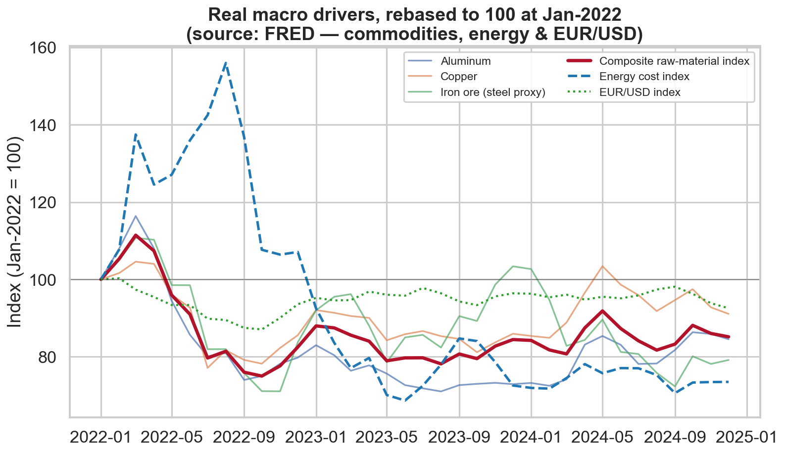
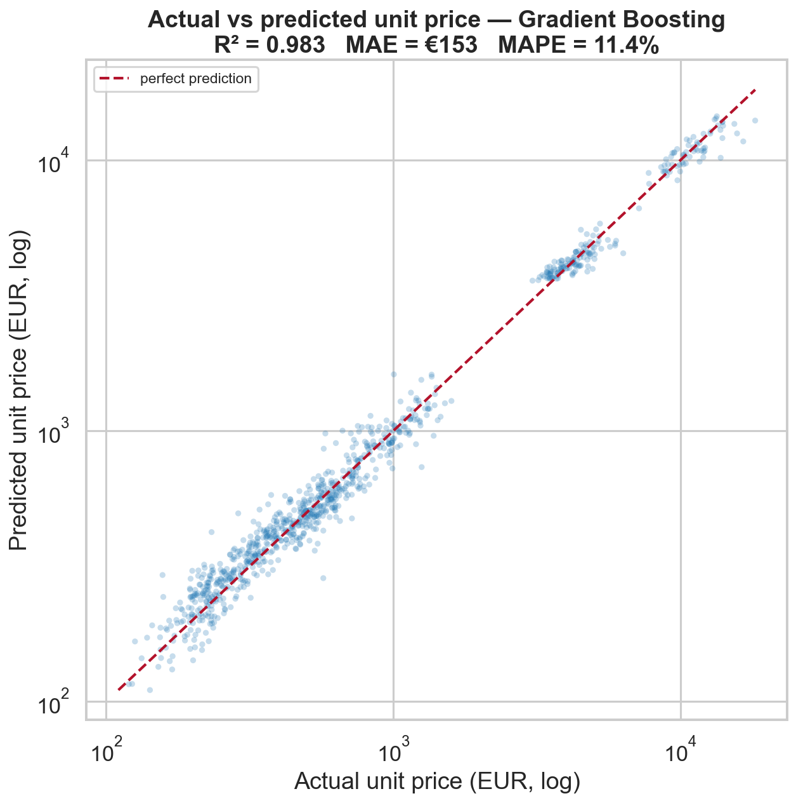
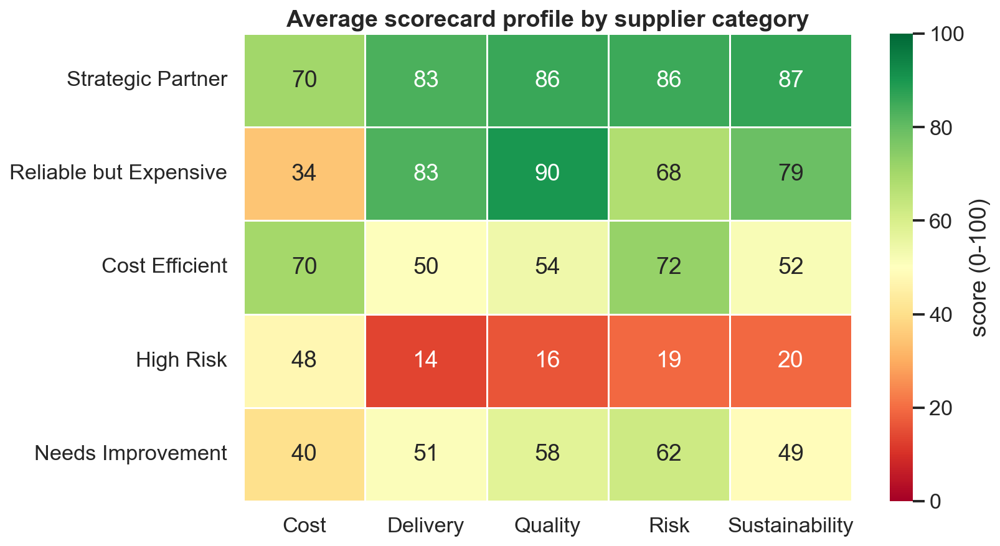
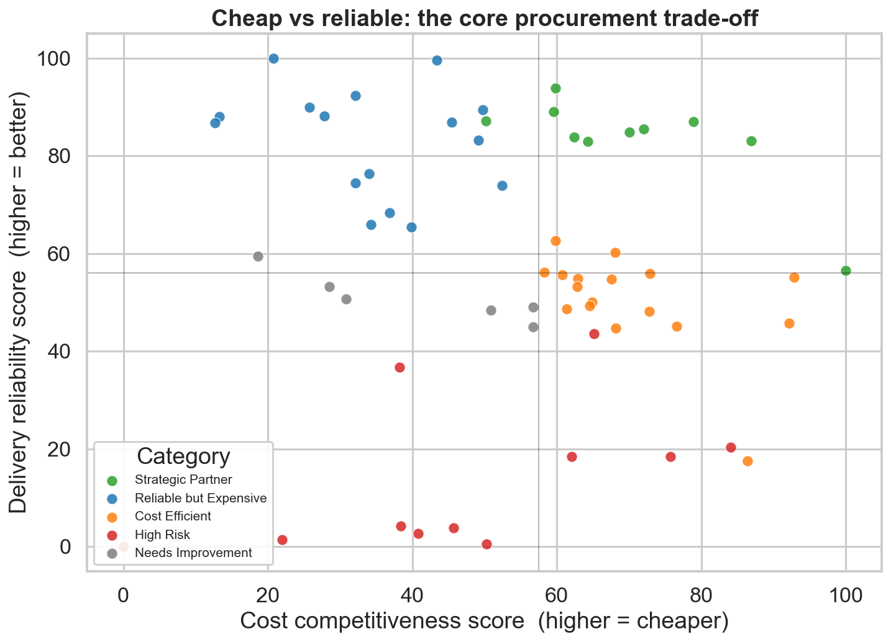

# Automotive Procurement Price Intelligence

**An end-to-end procurement analytics project combining public macroeconomic reference data with synthetic supplier-quote data to forecast component prices and build a supplier scorecard for strategic purchasing decisions.**

> Business case inspired by real industry challenges in a **premium automotive manufacturer**. It does not use or represent any specific company's data.

 -success)  

A strategic purchasing team has to decide, across dozens of component suppliers, **who to prioritize, renegotiate, monitor or replace**. This project answers that with a reproducible data pipeline that (1) pulls *real* commodity, energy and FX series, (2) uses them to drive a realistic *synthetic* supplier-quote dataset, (3) forecasts the expected unit price of a component, and (4) ranks every supplier on a transparent 0–100 scorecard with a concrete recommended action.

---

## 1. Business Context

In automotive purchasing, component prices are not arbitrary — they move with **raw-material markets (aluminum, copper, steel), energy costs and exchange rates**. At the same time, the "cheapest" supplier is rarely the best choice once **delivery reliability, quality, supply-chain risk and sustainability** are taken into account.

A category manager therefore needs two things:

1. an **expected price** for a component given current market conditions (to spot over-priced quotes and quantify cost drivers), and
2. a **balanced supplier ranking** that turns five competing criteria into one defensible decision.

## 2. Objective

> **Which suppliers offer the best balance between price competitiveness, delivery reliability, quality, risk and sustainability — and what should we do with each of them?**

The deliverable is a system that helps a purchasing team decide which suppliers to **prioritize for long-term contracts, renegotiate, monitor, reduce dependency on, keep as backup, or develop into strategic partners.**

## 3. Data Acquisition Strategy

**Core principle: real public / reference data first, synthetic business data second.**

Supplier quotations are confidential and never public, so they are simulated — but every market driver that influences price is taken from **real public sources** and the simulation is calibrated to it.

| Layer | Source | What it provides |
|-------|--------|------------------|
| **Real** (live download) | [FRED](https://fred.stlouisfed.org/) — St. Louis Fed | Aluminum, copper & iron-ore (steel proxy) prices; global energy index; EUR/USD rate |
| **Reference** (curated table) | Documented in code | Country → region, freight distance to Germany, supply-chain risk proxy, currency |
| **Synthetic** (calibrated) | `src/data_generation.py` | Supplier quotes, quality, delivery, risk & sustainability metrics |

The acquisition step (`src/data_acquisition.py`) downloads the FRED CSV endpoint (no API key required), rebases every series to **100 at Jan-2022**, and writes a provenance file (`data/external/_acquisition_metadata.json`) recording source, URLs, row counts and timestamp. **If the network is unavailable, every series transparently falls back to a documented sample series** so the pipeline always runs. Full detail in [`data/README_data.md`](data/README_data.md).

The real data already tells a story the project leans on: the **2022 European energy crisis** (energy index peaking at **156**, +56% vs Jan-2022, before falling to **69**), cooling commodity markets (raw-material index 111 → 75) and a **weakening euro** (EUR/USD index down to 87).



## 4. Dataset Description

**Grain:** one row = one historical supplier quote / delivery.
**Size:** ~4,500 quotes · 60 suppliers · 10 component types · 36 months (2022–2024) · 8 countries.

A star-schema layout is used: a **fact table** of quotes (`data/raw/supplier_quotes.csv`) and a **supplier dimension table** (`data/raw/supplier_master.csv`). Key columns of the fact table:

`quote_id, supplier_id, supplier_name, component_type, component_category, country, region, year, month, order_volume, unit_price, raw_material_index, energy_cost_index, exchange_rate_index, lead_time_days, on_time_delivery_rate, defect_rate, warranty_claim_rate, supplier_capacity_utilization, logistics_cost, risk_score_external, contract_type, sustainability_score, final_awarded`

Preprocessing adds analytical features such as `total_order_value`, `price_ratio_vs_median` (each quote relative to its component's market median — the like-for-like cost signal) and `landed_unit_cost`.

## 5. Synthetic Data Assumptions

Prices are generated from an explicit, auditable formula so the **real** macro series genuinely drive them:

```
unit_price = base_price[component]
           × material_factor(raw_material_index)      ← real FRED commodities
           × energy_factor(energy_cost_index)          ← real FRED energy index
           × capacity_factor(capacity_utilization)     ← scarcity pricing
           × fx_factor(exchange_rate_index)            ← real FRED EUR/USD
           × scale_factor(order_volume)                ← economies of scale
           × landed_factor(distance_to_germany)        ← logistics premium
           × contract_factor(contract_type)            ← Spot > Annual > Multi-year
           × archetype_factor(supplier)                ← supplier competitiveness
           × (1 + volatility noise)
```

Behaviour is governed by hidden **supplier archetypes** (Strategic Partner, Cost Efficient, Reliable-but-Expensive, High-Risk, Balanced, Underperformer) so the data contains a real structure for the scorecard to rediscover. All coefficients live in [`src/config.py`](src/config.py). The encoded relationships are verified at build time — e.g. Aluminum Casting price vs raw-material index **r = 0.51**, Spot price volatility (0.21) > Annual (0.17) > Multi-year (0.15), economies of scale (volume↑ → price↓). Limitations are listed in [`data/README_data.md`](data/README_data.md).

## 6. Price Forecasting Methodology

**Target:** `unit_price`. **Features:** component type & category, country, region, order volume, the three macro indices, lead time, capacity utilization, logistics cost, contract type, sustainability. Three models on an 80/20 split:

| Model | MAE (€) | RMSE (€) | R² | MAPE |
|-------|--------:|---------:|----:|-----:|
| **Gradient Boosting** (best) | 153 | 389 | **0.983** | 11.4% |
| Random Forest | 144 | 390 | 0.983 | **8.0%** |
| Linear Regression (baseline) | 294 | 593 | 0.961 | 39.6% |

Non-linear models clearly beat the linear baseline — especially on MAPE — because price drivers act **multiplicatively**. The high R² is expected (prices are simulated from these drivers); on real quotes one would expect lower, so the result is read as a sanity check of the generating process, not a claim of real-world accuracy.



## 7. Supplier Scorecard Methodology

Quotes are aggregated to one row per supplier and scored 0–100 on five **configurable** weighted dimensions ([`src/config.py`](src/config.py) → `SCORECARD_WEIGHTS`):

| Dimension | Weight | Basis (direction-aware, min-max across the pool) |
|-----------|:------:|--------------------------------------------------|
| Cost competitiveness | 30% | `price_ratio_vs_median` (lower price = better) |
| Delivery reliability | 25% | on-time delivery rate |
| Quality performance | 20% | defect & warranty claim rates |
| Risk exposure | 15% | external supply-chain risk |
| Sustainability | 10% | sustainability score |

Each supplier is mapped to a **category** and a **recommended action**. Validating the categories against the hidden generating archetypes gives **67% agreement**, with intuitive disagreements (premium-but-pricey "Strategic" suppliers flagged "Reliable but Expensive"). Output: [`reports/supplier_scorecard.csv`](reports/supplier_scorecard.csv).



## 8. Key Insights

- **Component type sets the price tier** (Battery Module ≈ €10.5k vs Wiring Harness ≈ €203, a ~50× range); commodities, energy, FX and logistics drive the *variation within* a tier.
- **Material-intensive parts track commodity markets**: Aluminum Casting price vs raw-material index **r = 0.51**.
- **Economies of scale are real but modest**: larger orders price below their component median.
- **Cheap ≠ good**: the cheapest suppliers cluster in the low-reliability quadrant, while top all-rounders sit in the high-cost-competitiveness *and* high-reliability corner.
- **Geography concentrates risk**: the five lowest-scoring suppliers are all China-based; the top performers are EU (Czech Republic, Spain, Germany).
- **11 High-Risk suppliers carry €648M — 14.7% of total spend** — a concrete dependency-reduction target.



## 9. Business Recommendations

| Action | Suppliers | Rationale |
|--------|:---------:|-----------|
| **Prioritize for long-term contract** | 10 | Strategic Partners — best balanced scores (avg 81) |
| **Renegotiate price** | 13 | Reliable-but-Expensive carry the **largest spend share (33%)** at premium prices |
| **Develop as strategic partner** | 12 | Cost-Efficient with acceptable quality — upside if reliability improves |
| **Reduce dependency** | 14 | High-Risk / risky-premium suppliers concentrating ~15% of spend |
| **Monitor quality risk** | 6 | Weak quality signals to watch before they escalate |
| **Keep as backup supplier** | 5 | Mediocre but not risky — useful for surge capacity |

## 10. Tech Stack

Python 3.12 · pandas · numpy · scikit-learn · matplotlib · seaborn · requests · Jupyter. Real data via the FRED public CSV endpoint.

## 11. How to Run

```bash
# 1. install
pip install -r requirements.txt

# 2. run the whole pipeline end-to-end (~30s)
python run_pipeline.py
```

Or run any stage on its own:

```bash
python -m src.data_acquisition     # 1. real macro data + reference table
python -m src.data_generation      # 2. synthetic supplier quotes
python -m src.preprocessing        # 3. clean analytical dataset
python -m src.price_model          # 4. price forecasting + metrics
python -m src.supplier_scoring     # 5. supplier scorecard
python -m src.visualization        # 6. all 10 figures
```

The narrative analysis lives in `notebooks/01…05`. Everything is reproducible (fixed random seed + fixed analysis window); re-running regenerates identical data and outputs.

```
automotive-procurement-price-intelligence/
├── data/
│   ├── external/      # real FRED indices + country reference + provenance
│   ├── raw/           # supplier_quotes.csv (fact) + supplier_master.csv (dim)
│   ├── processed/     # cleaned analytical dataset
│   └── README_data.md # sources, synthetic assumptions, lineage, limitations
├── notebooks/         # 01 acquisition · 02 generation · 03 EDA · 04 model · 05 scorecard
├── src/               # config, data_acquisition, data_generation, preprocessing,
│                      # price_model, supplier_scoring, visualization
├── reports/
│   ├── figures/       # 01_*.png … 10_*.png
│   ├── supplier_scorecard.csv
│   ├── model_comparison.csv
│   └── executive_summary.md
├── run_pipeline.py    # one-command end-to-end run
├── requirements.txt
└── README.md
```

## 12. Portfolio Relevance

This project demonstrates the full **data extraction → cleaning → enrichment → analytical dataset → modeling → insights → business decision** workflow that procurement, BI and data-science teams run in practice:

- **Data engineering**: real API/CSV acquisition with provenance, fallbacks, and a star-schema data model.
- **Honest synthetic data**: clearly separated from real data, calibrated to it, and validated against ground truth.
- **Modeling**: a baseline-vs-ensemble comparison with the right metrics (MAE/RMSE/R²/MAPE) for a pricing problem.
- **Decision support**: a configurable, transparent scorecard that ends in a concrete action per supplier — not just a chart.

Relevant for internships in **Data Science, Business Analytics, BI, Procurement / Logistics Analytics, Customer Insights and Automotive Strategy.**

---

**Author:** [sudomanuel](https://github.com/sudomanuel)
